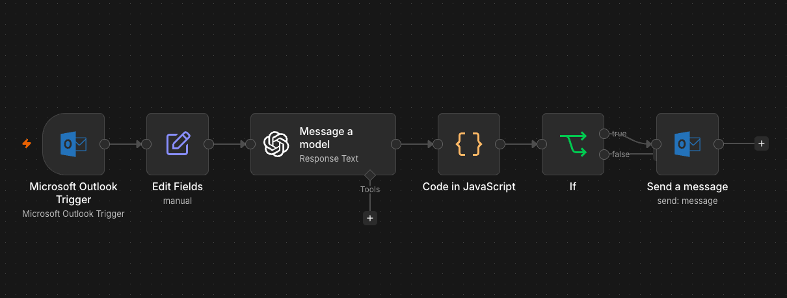

# AI Email Triage

An AI-powered email triage workflow built with n8n that automatically analyses incoming Outlook emails, identifies their purpose and urgency, and sends an alert when a high-priority email requires attention.

## Business Problem

Important emails can easily be missed when an inbox receives a mixture of customer requests, administrative messages, marketing emails and newsletters.

Manually reviewing and prioritising every incoming email also takes time.

This project explores how AI and workflow automation can be used to automatically analyse incoming emails and identify messages that may require urgent attention.

## Solution

I built an automated email triage workflow using n8n, Microsoft Outlook and OpenAI.

When a new email is detected, the workflow extracts the email content and sends it to an AI model for analysis.

The AI returns structured information including:

- Email type
- Summary
- What the sender is requesting
- Whether action is required
- Urgency level
- Suggested draft reply

The workflow then processes the AI response and checks the urgency level. If the email is classified as **High** urgency, an Outlook alert is automatically sent so that the message can be reviewed quickly.

## How It Works

1. **Microsoft Outlook Trigger**  
   Monitors the Outlook inbox for new emails.

2. **Edit Fields**  
   Extracts the relevant email content and prepares it for AI processing.

3. **OpenAI Analysis**  
   Analyses the email and returns a structured JSON response containing the email category, summary, requested action, urgency and a suggested reply.

4. **JavaScript Processing**  
   Parses the AI-generated JSON so the information can be used by later workflow steps.

5. **Conditional Logic**  
   Checks whether the AI has classified the email urgency as `High`.

6. **Outlook Alert**  
   If the email is high urgency, an automated alert is sent through Microsoft Outlook.

## Workflow Architecture



Incoming Outlook Email  
↓  
Extract Email Content  
↓  
OpenAI Analysis  
↓  
Classify + Summarise + Determine Urgency  
↓  
Parse AI Response with JavaScript  
↓  
Check: Urgency = High?  
↓  
Send Outlook Alert

## Technologies Used

- n8n
- OpenAI
- Microsoft Outlook
- JavaScript
- JSON
- Workflow Automation
- Conditional Logic

## Skills Demonstrated

This project demonstrates practical experience with:

- Designing end-to-end automation workflows
- Integrating Microsoft Outlook with AI services
- Prompt engineering for structured AI output
- Using JSON as a structured data format
- Processing AI responses with JavaScript
- Implementing conditional business rules
- Automating actions based on AI-generated classifications
- Translating a business problem into an automated solution

## Example AI Output

The AI is instructed to return a structured response similar to:

```json
{
  "type": "Customer Request",
  "summary": "Customer is requesting an update on an outstanding matter.",
  "customer_wants": "An update on their request",
  "action_needed": true,
  "urgency": "High",
  "draft_reply": "Thank you for your email. We are reviewing your request and will provide an update shortly."
}
