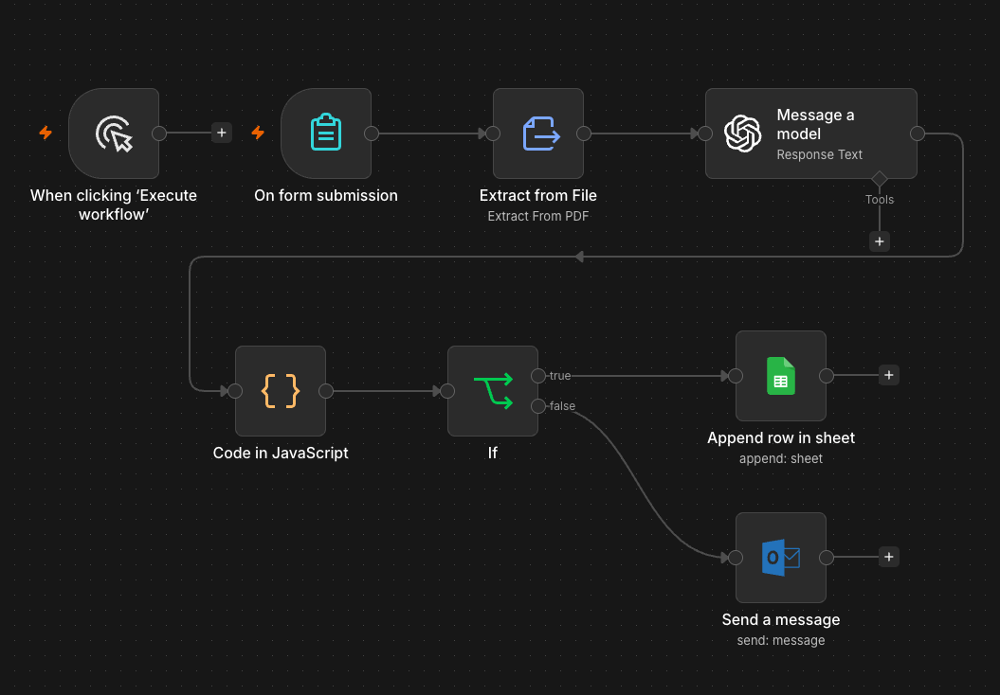

# AI Invoice Processor

An AI-powered invoice processing workflow built with n8n that automatically extracts information from uploaded PDF invoices, uses AI to convert the information into structured data, validates the result, and records successfully processed invoices in Google Sheets.

## Business Problem

Processing invoices manually can be repetitive and time-consuming.

Staff may need to open each invoice, identify important information such as the supplier, invoice number, dates, GST and total amount, and then manually enter that information into a tracking system.

Manual processing also creates the risk of data entry errors and invoices requiring attention being overlooked.

This project explores how AI and workflow automation can streamline invoice processing while still identifying documents that require manual review.

## Solution

I built an automated invoice processing workflow using n8n, OpenAI and Google Sheets.

A user uploads an invoice PDF through an n8n form. The workflow extracts the text from the PDF and sends the document content to an AI model for analysis.

The AI extracts structured invoice information including:

- Supplier
- Invoice number
- Invoice date
- Due date
- Total amount
- Currency
- GST
- Purchase description

The AI is instructed not to guess missing information and instead return `Not found` when information cannot be identified.

The workflow then parses the AI response and validates whether a supplier was successfully identified.

If the invoice passes validation, the extracted information is automatically added to an invoice tracker in Google Sheets.

If the supplier cannot be identified, the workflow sends an Outlook notification indicating that manual review is required.

## How It Works

1. **Invoice Upload Form**  
   A user uploads an invoice PDF through an n8n form.

2. **PDF Text Extraction**  
   The workflow extracts the text content from the uploaded invoice.

3. **OpenAI Analysis**  
   The extracted document is analysed by AI and converted into structured invoice data.

4. **JavaScript Processing**  
   The AI-generated JSON response is parsed so that individual invoice fields can be used by later workflow steps.

5. **Validation**  
   The workflow checks whether the supplier was successfully identified.

6. **Google Sheets**  
   Valid invoice information is automatically appended to an invoice tracking spreadsheet.

7. **Manual Review Alert**  
   If the supplier cannot be identified, an Outlook notification is automatically sent requesting manual review.

## Workflow Architecture



Invoice PDF Upload  
↓  
Extract PDF Text  
↓  
OpenAI Invoice Analysis  
↓  
Extract Structured Invoice Data  
↓  
Parse JSON with JavaScript  
↓  
Validate Supplier  
↓  
**Valid → Add Invoice to Google Sheets**  
**Invalid → Send Manual Review Alert**

## Technologies Used

- n8n
- OpenAI
- Google Sheets
- Microsoft Outlook
- JavaScript
- JSON
- PDF Text Extraction
- Workflow Automation
- Conditional Logic

## Skills Demonstrated

This project demonstrates practical experience with:

- Designing end-to-end business automation workflows
- Applying AI to document processing
- Extracting structured information from unstructured documents
- Prompt engineering for structured JSON output
- Processing AI responses using JavaScript
- Integrating AI with Google Sheets
- Implementing validation and conditional business rules
- Designing exception handling for manual review
- Translating a manual business process into an automated solution

## Example AI Output

The AI is instructed to return structured invoice information similar to:

```json
{
  "supplier": "Example Supplier Pty Ltd",
  "invoice_number": "INV-1001",
  "invoice_date": "01/09/2026",
  "due_date": "30/09/2026",
  "total_amount": "1250.00",
  "currency": "AUD",
  "gst": "113.64",
  "description": "Business supplies"
}
```

## Business Value

This type of automation could help a business:

- Reduce manual invoice data entry
- Improve consistency of invoice information
- Reduce repetitive administrative work
- Create a centralised invoice tracking process
- Identify invoices that require human review
- Allow staff to focus on exceptions rather than manually processing every document

## Future Improvements

Possible future enhancements include:

- Checking for duplicate invoice numbers before recording an invoice
- Adding approval workflows based on invoice value
- Matching invoices against purchase orders
- Automatically categorising expenses
- Recording processing status and timestamps
- Adding additional validation rules before invoices are accepted
- Integrating the workflow with accounting or ERP systems

## Workflow File

A sanitised version of the n8n workflow is included in this repository:

`02-ai-invoice-processor-portfolio.json`

Credentials, personal information, spreadsheet identifiers and environment-specific configuration have been removed or replaced with placeholders before publication.

## Project Status

Portfolio project / prototype developed to demonstrate practical AI, document processing and business workflow automation capabilities.
